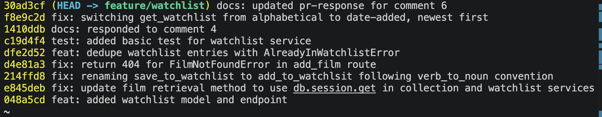

# PR Response Doc — CineLog Watchlist Feature

## AI Usage

- **Test authoring:** Asked Claude to mirror `test_collection.py`'s fixture/assertion structure (the `app`/`sample_user`/`sample_film` fixtures, in-memory SQLite setup) into a new `tests/test_watchlist.py`, producing `test_add_to_watchlist_nonexistent_film_raises` and later `test_get_watchlist_returns_newest_first`, following the same patterns as the existing collection tests rather than inventing a new test structure.
- **Commit hygiene review:** Asked Claude to check whether my commit messages followed the Conventional Commits spec and whether any bundled multiple logical changes into one commit. It flagged that `fix: adding dedupe logic to add_to_watchlist and proper error handling for both exception types in the route` actually conformed to two types — a new `feat` (the dedupe check and its required `AlreadyInWatchlistError` handling) bundled with an unrelated, pre-existing `fix` (the route never caught `FilmNotFoundError`, so it 500'd instead of returning 404, independent of the dedupe work). I had it split that commit into two via an interactive rebase (`edit` + reset + re-commit) rather than leaving the mixed commit in history.
- **Rebase conflict diagnosis:** After rebasing onto main's UUID-migration commit, I noticed the `WatchlistEntry` model had disappeared from `models.py` with no conflict ever being flagged. Used Claude to diagnose why: git's 3-way rebase merge only raises a conflict when both sides edit overlapping lines, and none of my commits contained any diff touching `models.py` (the class was assumed present from the shared root commit) — so when main's refactor commit rewrote that file and dropped the class, git had nothing to compare against and silently kept main's version. Used Claude to redo the rebase correctly with `git rebase -i`, marking the relevant commit `edit` to stop and manually restore `WatchlistEntry` (with `film_id` migrated to UUID) before continuing.

## Comment 1 — Rename
**What I did:** I used VSCode's search to find uses of `save_to_watchlist`. I updated usages and corresponding imports. I also looked for usages of just `save` to ensure I didn't leave anything behind, and in that I identified the documentation using `save`-language which I changed to `add`-langauge.

**How I verified:** I invoked the add endpoint from the watchlist routes using:

``` 
curl -X POST http://localhost:5000/watchlist/1/add   -H "Content-Type: application/json"   -d '{"film_id": 1}'
```

And checked that it worked E2E.

## Comment 2 — Deduplication
**What I did:** Before implementing this, I looked at how `services/collection_service.py` already handles the same problem for collections: `add_to_collection()` checks for an existing `(user_id, film_id)` pair and raises `AlreadyInCollectionError`, which `routes/collection.py`'s `add_film` route catches and turns into a `409`. I mirrored that exact pattern for the watchlist: `add_to_watchlist()` in `services/watchlist_service.py` queries `WatchlistEntry.query.filter_by(user_id=user_id, film_id=film_id).first()` before creating a new entry, and if a match already exists, raises a new `AlreadyInWatchlistError` instead of silently creating a duplicate row. `routes/watchlist/watchlist.py`'s `add_film` route then catches `AlreadyInWatchlistError` the same way collection's route catches `AlreadyInCollectionError`, returning `409` with `{"error": "Film '<film_id>' is already in this user's watchlist"}`.

**How I verified:** I ran the same curl (adding the same `film_id` for the same `user_id`) twice — the first call returns `201` with the new entry, the second returns `409` with the error message above instead of a second row being created.

## Comment 3 — Missing test
**What I did:** I used Claude to mirror `test_add_to_collection_nonexistent_film_raises` from `tests/test_collection.py`, reusing the same `app`/`sample_user` fixture structure (in-memory SQLite, isolated per test), in a new file `tests/test_watchlist.py`. The new test, `test_add_to_watchlist_nonexistent_film_raises`, calls `add_to_watchlist()` with a fake UUID that doesn't correspond to any row in the `Film` table, and asserts that it raises `FilmNotFoundError` — the same edge case the collection test targets (a nonexistent `film_id`, not e.g. a missing `user_id` or a malformed UUID), just for the watchlist service instead of the collection service.

**How I verified:** I validated the test logic against the fixture pattern, then ran it with `pytest tests/test_watchlist.py -v` and confirmed it passed.

## Comment 4 — Default visibility
**My position:** I'm keeping `public=True` as the default for watchlist entries.

**Reasoning:** A watchlist is fundamentally different from a collection (films already watched) — it's a list of intent, and intent-to-watch is the kind of data that's valuable when it's visible to others. The behavior I'm optimizing for is social discovery: friends browsing each other's watchlists for "what should I watch next" recommendations, and the light social pressure of a visible watchlist nudging someone to actually watch what they said they wanted to. That only works if lists are public by default — if we default to private, the watchlist feature launches as a personal to-do list with zero network effect on day one, and visibility becomes an opt-in action almost nobody takes (defaults are sticky; the vast majority of users never change a boolean toggle buried in a settings screen). Given this app's collection feature already treats logged/watched films as shareable activity, a private-by-default watchlist would also be an inconsistent, surprising exception within the product rather than a deliberate privacy boundary.

**Tradeoff acknowledged:** The real cost of `public=True` is that it favors the platform's growth/engagement goals over the individual user's privacy-by-default expectation. A user adding films to their watchlist for embarrassing, sensitive, or simply personal reasons (a guilty-pleasure genre, films tied to a breakup, screening picks for a therapist-recommended list, etc.) is opted into visibility before they've made any affirmative choice, and most people don't audit privacy settings after signup. If we ever see evidence that users are surprised or upset that their watchlist was visible, that's a strong signal to flip the default — but absent that signal, I think the discovery/engagement upside for a nascent social feature outweighs the downside, given the field exists precisely so any individual user can flip it to private with one write.

## Comment 5 — Sort order
**My position:** I'm switching `get_watchlist()` from alphabetical (`Film.title.asc()`) to date-added, newest-first (`WatchlistEntry.date_added.desc()`), matching the maintainer's preference.

**Engagement with reviewer's point:** I agree, and I don't think this is a close call once I looked at it next to the collection feature. `get_collection()` already sorts newest-first by `date_added` (see `test_get_collection_returns_newest_first` in test_collection.py), precisely because a "recently logged" list is more useful sorted by recency than by title. A watchlist is even more recency-sensitive than a collection: it's a list of current intent, and the entries a user is most likely to act on *right now* are the ones they just added — whatever movie prompted them to open the app and add something is the one they're most likely to actually watch next. Alphabetical order actively works against that: a film added five minutes ago named "Zootopia" gets buried at the bottom, even though it's the freshest and most actionable entry. Alphabetical sort is a reasonable default for *browsing/searching* a large catalog (which is what `Film.query` in routes/films.py optimizes for), but it's the wrong default for a personal, intent-ordered list — and my original choice of `Film.title.asc()` was just inherited from copy-pasting the query shape rather than a deliberate call, which is exactly the kind of default the maintainer was right to push on.

The one place I'd flag as a real tradeoff: newest-first means a watchlist a user hasn't touched in months will have their oldest (possibly most-intended, "I've been meaning to watch this for a year") entries scrolled past everything recent. If that becomes a real pain point, a secondary user-facing sort toggle (recency vs. alphabetical vs. by-genre) would be a reasonable follow-up, but I don't think it should block this default.

**Bug found and fixed along the way:** Implementing/testing this surfaced a separate pre-existing bug — `get_watchlist()` calls `entry.film.to_dict()`, but unlike `Film.collection_entries = db.relationship("CollectionEntry", backref="film", ...)`, there was no equivalent `watchlist_entries` relationship on `Film` giving `WatchlistEntry` a `.film` backref. This meant `GET /watchlist/<user_id>` crashed with `AttributeError: 'WatchlistEntry' object has no attribute 'film'` on every call — sort order was unreachable code. I added `watchlist_entries = db.relationship("WatchlistEntry", backref="film", lazy=True)` to `Film` in models.py, mirroring the existing collection relationship exactly.

**How I verified:** Added `test_get_watchlist_returns_newest_first` to tests/test_watchlist.py, mirroring `test_get_collection_returns_newest_first`'s fixture/assertion structure — two films added to the watchlist out of alphabetical order relative to their `date_added` timestamps, asserting the more-recently-added one comes first. Ran the full suite (`pytest tests/ -v`): all 6 tests pass, including this new one and the pre-existing collection tests (confirming the `Film` model change didn't regress collection behavior).

**Stretch — second test:** This is a second test beyond the one required for Comment 3 (`test_add_to_watchlist_nonexistent_film_raises`), committed separately as `test: add test for watchlist newest-first ordering`. I deliberately chose "Alien" (1979) and "Blade Runner" (1982) as the two films specifically because their titles sort in the *opposite* order from their `date_added` timestamps — "Alien" added most recently, "Blade Runner" added five days earlier, but "Alien" alphabetically precedes "Blade Runner." That's the only kind of case that can actually distinguish the two sort orders: if a test used films whose title order and date order happened to agree, the assertion would pass under both the old (wrong) alphabetical code and the new (correct) date-based code, and wouldn't prove the fix does anything. Picking titles that disagree with recency order is what makes the test meaningful.

## Comment 6 — Rebase
**What conflicted:** Only `.gitignore` (an add/add conflict — both main and my branch independently created one). It resolved trivially by keeping the union of both sets of ignore patterns.

**What did *not* conflict, but should have been caught:** `models.py`. Main's `refactor: migrate film IDs from integer to UUID` commit rewrote `models.py` and, in doing so, dropped the `WatchlistEntry` class entirely (it existed at the shared root commit but wasn't carried forward by that refactor, since the watchlist feature hadn't merged into main yet). My own commits never contained a diff touching `models.py` — they assumed the class was already present in the base. Git's 3-way rebase merge only flags a conflict when both sides edit overlapping lines; since my side had zero edits to that file, there was nothing to compare against main's change, and git silently kept main's version — which has no `WatchlistEntry` at all. First rebase attempt completed with no errors and no conflict markers, but would have broken every watchlist route/service at import time (`NameError: name 'WatchlistEntry' is not defined`).

**How I resolved it:** Redid the rebase using `git rebase -i origin/main`, marking the commit that originally added the watchlist model/endpoint (`add watchlist model and endpoint`) as `edit` instead of `pick`. This stopped the rebase right after that commit applied, before any later commits built on top, letting me inspect `models.py` at that exact point and confirm the class was missing. I then manually re-added `WatchlistEntry` to `models.py`, using `film_id = db.Column(db.String(36), db.ForeignKey("film.id"), ...)` to match the UUID type from main's refactor (instead of the original `db.Integer`), and updated the stale `add_to_watchlist` docstring that still said `film_id (int)... pre-refactor`. I amended that commit with both fixes, then ran `git rebase --continue` — the remaining 7 commits (the dedupe logic, rename, sort-order, and my earlier `watchlist_entries` backref fix) all applied cleanly on top, since none of them touch the newly-restored lines in a conflicting way.

**How I verified no conflict remains:** `git status` shows a clean working tree and no unmerged paths. `git log --oneline --merges origin/main..HEAD` returns nothing, confirming no merge commits were introduced by the rebase (the one merge commit visible in `git log --graph`, `bbe206c`, is main's own preexisting history, not something created by this rebase). Ran the full test suite (`pytest tests/ -v`): all 6 tests pass, confirming the UUID-typed `WatchlistEntry` works correctly end-to-end alongside the collection tests.

## PR Description

### What this adds

A watchlist feature for CineLog: users can save films they want to watch later, view that list, and the app prevents the same film from being added twice.

- `POST /watchlist/<user_id>/add` — add a film to a user's watchlist. Body: `{ "film_id": "<uuid>" }`. Returns `201` with the created entry, `404` if the film doesn't exist, or `409` if it's already on the user's watchlist.
- `GET /watchlist/<user_id>` — return all films on a user's watchlist, newest-added first, with `date_added` and `public` attached to each film.

This mirrors the existing collection feature's shape (`services/watchlist_service.py`, `routes/watchlist/watchlist.py`), but a watchlist represents *intent to watch* rather than films already watched, which drove both design decisions below.

### Design decisions

1. **Visibility defaults to public** (`WatchlistEntry.public = True`) — optimizing for social discovery (friends browsing each other's "want to watch" lists) rather than privacy-by-default. Full reasoning and the acknowledged tradeoff (users who'd prefer their watchlist private by default, and don't discover the toggle) are in [Comment 4](#comment-4--default-visibility) above.
2. **Sort order is newest-added-first** (`WatchlistEntry.date_added.desc()`), not alphabetical — a watchlist is recency-sensitive (the film you just added is the one you're most likely to act on next), and this also matches the existing collection feature's sort behavior. Full reasoning and the acknowledged tradeoff (older, long-intended entries get buried) are in [Comment 5](#comment-5--sort-order) above.

### Manual testing steps

1. Start the app with Flask's CLI (not `python app.py` directly — running the file directly double-imports it and breaks the shared `SQLAlchemy` instance):
   ```bash
   FLASK_APP=app flask run --debug
   ```
2. The database starts empty, so seed a film and a user via `flask shell`:
   ```bash
   FLASK_APP=app flask shell
   >>> from app import db
   >>> from models import Film
   >>> f = Film(title="Test Film", year=2020, genre="Drama")
   >>> db.session.add(f)
   >>> db.session.commit()
   >>> f.id   # copy this UUID for the curl commands below
   ```
3. Add the film to a watchlist (use any string as `<user_id>` for manual testing):
   ```bash
   curl -X POST http://localhost:5000/watchlist/1/add \
     -H "Content-Type: application/json" \
     -d '{"film_id": "<uuid from step 2>"}'
   ```
   Expect `201` with the new entry (`id`, `user_id`, `film_id`, `date_added`, `public: true`).
4. View the watchlist:
   ```bash
   curl http://localhost:5000/watchlist/1
   ```
   Expect a `200` with a list containing the film, `date_added`, and `public` attached.
5. Try adding the same film again:
   ```bash
   curl -X POST http://localhost:5000/watchlist/1/add \
     -H "Content-Type: application/json" \
     -d '{"film_id": "<same uuid>"}'
   ```
   Expect `409` with `{"error": "Film '<uuid>' is already in this user's watchlist"}`.
6. Try adding a nonexistent film:
   ```bash
   curl -X POST http://localhost:5000/watchlist/1/add \
     -H "Content-Type: application/json" \
     -d '{"film_id": "00000000-0000-0000-0000-000000000000"}'
   ```
   Expect `404` with `{"error": "No film found with id '00000000-0000-0000-0000-000000000000'"}`.
7. Try adding with no `film_id`:
   ```bash
   curl -X POST http://localhost:5000/watchlist/1/add \
     -H "Content-Type: application/json" -d '{}'
   ```
   Expect `400` with `{"error": "film_id is required"}`.
8. To check sort order specifically: repeat steps 2–3 with a second film, then re-run step 4 and confirm the second film (added more recently) appears first in the list.
9. Automated coverage: `pytest tests/ -v` — 6 tests covering collection and watchlist behavior (dedup, nonexistent-film handling, sort order) should all pass.

## Commit History
